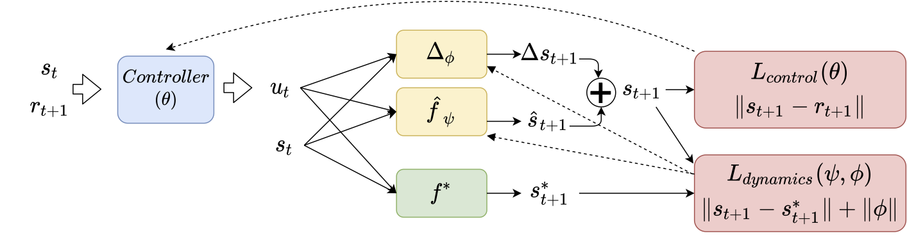

# Weakly supervised flight

In this project we train a autonomous UAV in semi-supervised fashion, only using the tracking error as a loss. The formulation is shown below.



Install all requirements in a virtual environment with 

```
python -m venv env
source env/bin/activate
cd weakly_supervised_flight
pip install -e .
```

In the following it is described how to train models for the three considered robotics systems Quadrotor, Fixed-wing drone and CartPole. If not noted otherwise, all commands are executed from the main directory.

## Quadrotor - Learning control and adaptation

#### Pre-train a controller with BPTT
```
python scripts/train_drone.py -t pretrain
```

### Adapt to changed translational drag
The scenario considered in our paper is a velocity drag factor of 0.3. This is hard-coded and can only be changed in [here](scripts/train_drone.py). To adapt the dynamics for 10 epochs (configure in `configs/quad_config.json`), and then finetune the controller, run
```
python scripts/train_drone.py -t "adapt" -s "test_save_path"
```
The model will be saved at `trained_models/quad/test_save_path`. 

### Train a controller unsupervised

On the bottom of the script `train_drone.py`, `train_cartpole.py` or `train_fixed_wing.py`, you can use the `run_control` function to train a model from scratch. Make sure that `baseline_model=None` to start from scratch.

### Reproduce basic dynamic mismatch experiments:

On the bottom of the script `train_drone.py`, `train_cartpole.py` or `train_fixed_wing.py` you can specify a dictionary with all modified parameters. Then, specify in a list all parameters that should not be trainable. If `not_trainable="all"` then only the residual network is trained to account for the mismatch. 
Then, make sure the script executes the `train_dynamics(baseline_model, config, trainable_params)` with a given controller (aka baseline model) and the list of trainable parameters.


### Train cartpole image model

BRANCH: cartpole

This part is more complicated and requires several steps:
* Collect a dataset in the target dynamics (for learning the new dynamics in few shot):
    * specify the desired modified parameters in the dictionary in `evaluate_cartpole.py`, and also specify the desired dataset size
    * Set `center_at_x=False` because we need to train the image dynamics to handle any shifted image
    * Set a filepath location where to save the dataset
    * run `python evaluate_cartpole.py -dataset` to generate the data
* Finetune the dynamics:
    * In `train_cartpole.py` specify the dataste you want to use in the `train_img_dynamics` function.
    * Execute the script with `train_img_dynamics(None, config, not_trainable="all", base_image_dyn=baseline_dyn)` in the bottom
    * This will train the residual to learn the change in dynamics from the images (Note: No need to specify the modified parameters here, this is included in the dataset)
    * Note: the controller can be really bad in this step
* Collect a dataset for the controller
    * Set `center_at_x=False` in `evaluate_cartpole.py` to have standardized images as input to the controller
    * Change the save path for this new dataset
    * Use a lower dataset size - This is just for starting, actually the data will be collected during evaluation
* Train the controller
    * In `train_cartpole.py` specify the dataste you want to use in the `train_img_controller` function.
    * Execute the script with `train_img_controller(None, config, not_trainable="all", base_image_dyn=baseline_dyn)` in the bottom, where `baseline_dyn` is now the path to the dynamics model trained above


### Train cartpole contact dynamics

BRANCH: contact_dyn

* Collect dataset with target dynamics:
    * Run `python evaluate_cartpole.py -d 3000` This collects 3000 samples with half of them with the contact force and half of them without
* pre-train controller on state-action history without modified dynamics
    * Use bottom part in `train_cartpole.py` for that
    * Generate dataset with no contact dynamics
    * Using self play and the dataset to train a controller --> Basically this is a normal cartpole controller, just that it does not only see the last state, but instead the last x states
* Finetune dynamics:
    * Other bottom part in `train_cartpole.py` --> use the dataset with contact dynamics as generated above, ensure no self play
    * Train for 100 epochs is sufficient
* Finetune controller with the residual network:
    * Bottom part in `train_cartpole.py` --> Starting from the pretrained controller, but backpropagating through the trained dynamics model